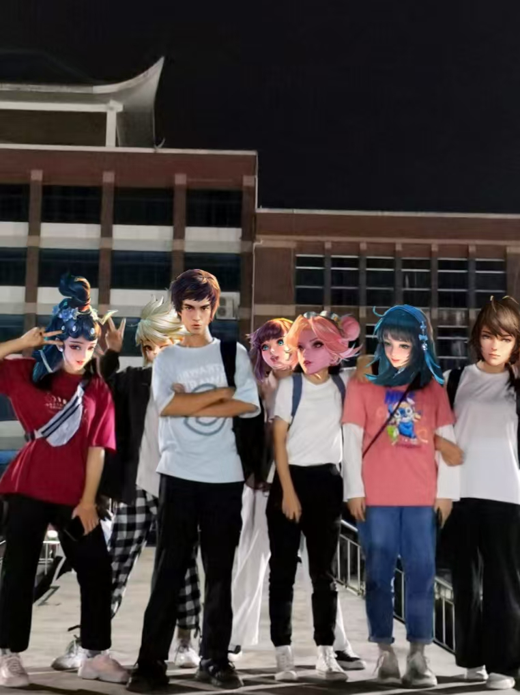

# 图片设置说明

## 集体合影图片

我已经在拜鸿教网站的"圣徒传人"部分添加了集体合影的展示区域。

### 当前状态
- 网站现在显示一个美观的占位符，提示需要添加实际图片
- 占位符使用了拜鸿教的主题色彩（棕色渐变）
- 包含了悬停效果和响应式设计

### 如何添加实际图片

1. **保存图片**：
   - 将您提供的集体合影保存为 `group-photo.jpg`
   - 确保图片质量良好，建议尺寸为 800x600 像素或更高

2. **放置图片**：
   - 将图片文件放在 `assets/images/` 目录中
   - 完整路径应该是：`assets/images/group-photo.jpg`

3. **更新HTML**：
   将以下代码：
   ```html
   <div class="group-photo-placeholder">
       <i class="fas fa-users"></i>
       <p>集体合影</p>
       <small>请将图片保存为 assets/images/group-photo.jpg</small>
   </div>
   ```
   
   替换为：
   ```html
   
   ```

### 图片效果
- 图片将自动适应容器大小
- 具有圆角边框和阴影效果
- 悬停时会有轻微的上移动画
- 底部有半透明的文字覆盖层
- 在所有设备上都能正常显示

### 图片建议
- 格式：JPG 或 PNG
- 尺寸：建议 800x600 像素或更高
- 内容：七位修行者的集体合影
- 质量：清晰、光线良好的照片

添加图片后，您的拜鸿教网站将更加完整和专业！
